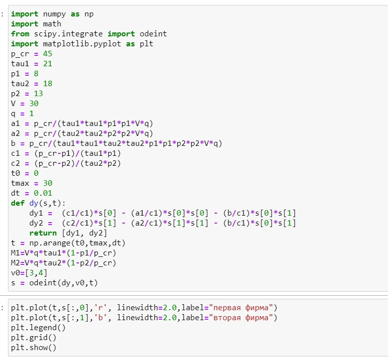
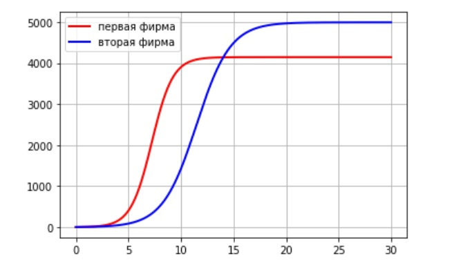
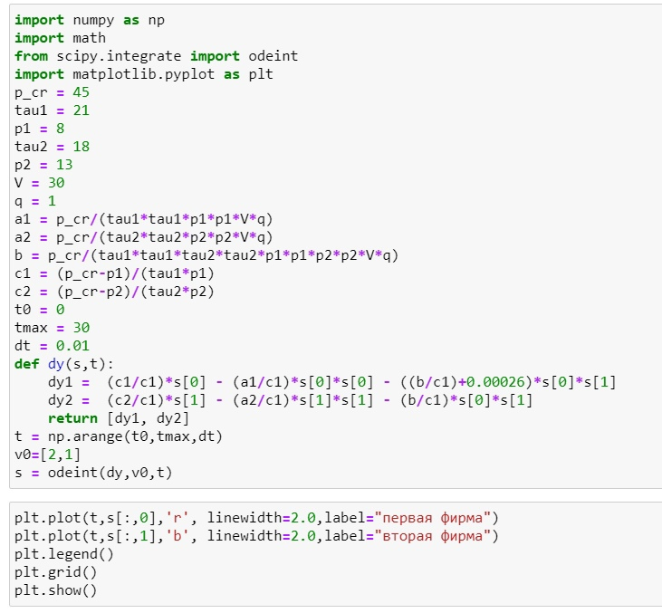
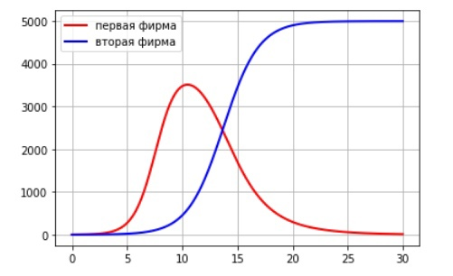

---
## Front matter
lang: ru-RU
title: Модель конкуренции двух фирм
author: Назарьева Алена НФИбд-03-18
institute:
	inst RUDN University, Moscow, Russian Federation
date: 2021, 30 march
## Formatting
toc: false
slide_level: 2
theme: metropolis
header-includes:
 - \metroset{progressbar=frametitle,sectionpage=progressbar,numbering=fraction}
 - '\makeatletter'
 - '\beamer@ignorenonframefalse'
 - '\makeatother'
aspectratio: 43
section-titles: true
---
# Цель работы

Изучить и реализовать Модель конкуренции двух фирм

# Задание

## 1)

Случай 1.
Рассмотрим две фирмы, производящие взаимозаменяемые товары
одинакового качества и находящиеся в одной рыночной нише. Считаем, что в рамках
нашей модели конкурентная борьба ведётся только рыночными методами. То есть,
конкуренты могут влиять на противника путем изменения параметров своего производства: себестоимость, время цикла, но не могут прямо вмешиваться в ситуацию на рынке («назначать» цену или влиять на потребителей каким-либо иным
способом.) Будем считать, что постоянные издержки пренебрежимо малы, и в
модели учитывать не будем. В этом случае динамика изменения объемов продаж
фирмы 1 и фирмы 2 описывается следующей системой уравнений:
dM1/dtetha=M1-(b/c1)M1M2-(a1/c1)M1M1
dM2/dtetha=(c2/c1)M2-(b/c1)M1M2-(a2/c1)M2M2,
где a1=p_cr/(tau1*tau1*p1*p1*N*q)
a2=p_cr/(tau2*tau2*p2*p2*N*q)
b=p_cr/(tau1*tau1*p1*p1*tau2*tau2*p2*p2*N*q)
c1=(p_cr-p1)/(tau1*p1)
c2=(p_cr-p2)/(tau2*p2)
Также введена нормировка t=c1*tetha

## 2)

Случай 2.
Рассмотрим модель, когда, помимо экономического фактора
влияния (изменение себестоимости, производственного цикла, использование
кредита и т.п.), используются еще и социально-психологические факторы –
формирование общественного предпочтения одного товара другому, не зависимо от
их качества и цены. В этом случае взаимодействие двух фирм будет зависеть друг
от друга, соответственно коэффициент перед
M1*M2 будет отличаться. Пусть в рамках рассматриваемой модели динамика изменения объемов продаж фирмы 1 и
фирмы 2 описывается следующей системой уравнений:
dM1/dtetha=M1-(b/c1)M1M2-(a1/c1)M1M1
dM2/dtetha=(c2/c1)M2-(b/c1+0.00026)M1M2-(a2/c1)M2M2
Для обоих случаев рассмотрим задачу со следующими начальными условиями и
параметрами:
M01=3, M02=4, p_cr=45, N=30, q=1, tau1=21, tau2=18, p1=8, p2=13
Замечание: Значения p_cr,p1,p2,N указаны в тысячах единиц, а значения
M1, M2 указаны в млн. единиц.
Обозначения:
N – число потребителей производимого продукта.τ – длительность производственного цикла
p – рыночная цена товара
p̃– себестоимость продукта, то есть переменные издержки на производство единицы
продукции.
q – максимальная потребность одного человека в продукте в единицу времени
tetha=t/c1 - безразмерное время
1. Постройте графики изменения оборотных средств фирмы 1 и фирмы 2 без
учета постоянных издержек и с веденной нормировкой для случая 1.
2. Постройте графики изменения оборотных средств фирмы 1 и фирмы 2 без
учета постоянных издержек и с веденной нормировкой для случая 2.

# Выполнение лабораторной работы

## 1)
Код в python для модели для первого случая (рис. -@fig:001)

{ #fig:001 width=70% }

## 2)
График изменения оборотных средств фирмы 1 и фирмы 2 без учета постоянных издержек и с веденной нормировкой.
По графику видно, что рост оборотных средств предприятий идет
независимо друг от друга. Каждая фирма достигает свое максимальное значение объема продаж и остается на
рынке с этим значением, то есть каждая фирма захватывает свою часть рынка
потребителей, которая не изменяется. (рис. -@fig:002)

{ #fig:002 width=70% }

## 3)
Код в python для модели для второго случая  (рис. -@fig:003)

{ #fig:003 width=70% }

## 4)
График изменения оборотных средств фирмы 1 и фирмы 2 без
учета постоянных издержек и с веденной нормировкой.
По графику видно, что первая фирма, несмотря на начальный рост,
достигнув своего максимального объема продаж, начитает нести убытки и, в итоге,
терпит банкротство. Динамика роста объемов оборотных средств второй фирмы
остается без изменения: достигнув максимального значения, остается на этом
уровне. (рис. -@fig:004)

{ #fig:004 width=70% }

# Выводы

В результате проделанной работы я изучила и реализовала Модель конкуренции двух фирм
