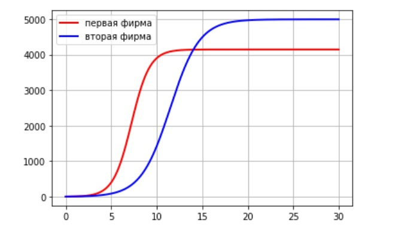
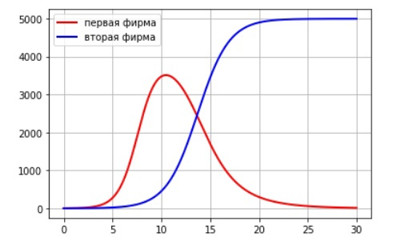

---
# Front matter
lang: ru-RU
title: "Oтчёт по лабораторной работе"
subtitle: "Модель конкуренции двух фирм"
author: "Назарьева Алена Игоревна НФИбд-03-18"

# Formatting
toc-title: "Содержание"
toc: true # Table of contents
toc_depth: 2
lof: true # List of figures
lot: true # List of tables
fontsize: 12pt
linestretch: 1.5
papersize: a4paper
documentclass: scrreprt
polyglossia-lang: russian
polyglossia-otherlangs: english
mainfont: PT Serif
romanfont: PT Serif
sansfont: PT Sans
monofont: PT Mono
mainfontoptions: Ligatures=TeX
romanfontoptions: Ligatures=TeX
sansfontoptions: Ligatures=TeX,Scale=MatchLowercase
monofontoptions: Scale=MatchLowercase
indent: true
pdf-engine: lualatex
header-includes:
  - \linepenalty=10 # the penalty added to the badness of each line within a paragraph (no associated penalty node) Increasing the value makes tex try to have fewer lines in the paragraph.
  - \interlinepenalty=0 # value of the penalty (node) added after each line of a paragraph.
  - \hyphenpenalty=50 # the penalty for line breaking at an automatically inserted hyphen
  - \exhyphenpenalty=50 # the penalty for line breaking at an explicit hyphen
  - \binoppenalty=700 # the penalty for breaking a line at a binary operator
  - \relpenalty=500 # the penalty for breaking a line at a relation
  - \clubpenalty=150 # extra penalty for breaking after first line of a paragraph
  - \widowpenalty=150 # extra penalty for breaking before last line of a paragraph
  - \displaywidowpenalty=50 # extra penalty for breaking before last line before a display math
  - \brokenpenalty=100 # extra penalty for page breaking after a hyphenated line
  - \predisplaypenalty=10000 # penalty for breaking before a display
  - \postdisplaypenalty=0 # penalty for breaking after a display
  - \floatingpenalty = 20000 # penalty for splitting an insertion (can only be split footnote in standard LaTeX)
  - \raggedbottom # or \flushbottom
  - \usepackage{float} # keep figures where there are in the text
  - \floatplacement{figure}{H} # keep figures where there are in the text
---

# Цель работы

Изучить и реализовать Модель конкуренции двух фирм

# Задание

Случай 1.
Рассмотрим две фирмы, производящие взаимозаменяемые товары
одинакового качества и находящиеся в одной рыночной нише. Считаем, что в рамках
нашей модели конкурентная борьба ведётся только рыночными методами. То есть,
конкуренты могут влиять на противника путем изменения параметров своего производства: себестоимость, время цикла, но не могут прямо вмешиваться в ситуацию на рынке («назначать» цену или влиять на потребителей каким-либо иным
способом.) Будем считать, что постоянные издержки пренебрежимо малы, и в
модели учитывать не будем. В этом случае динамика изменения объемов продаж
фирмы 1 и фирмы 2 описывается следующей системой уравнений:
dM1/dtetha=M1-(b/c1)M1M2-(a1/c1)M1M1
dM2/dtetha=(c2/c1)M2-(b/c1)M1M2-(a2/c1)M2M2,
где a1=p_cr/(tau1*tau1*p1*p1*N*q)
a2=p_cr/(tau2*tau2*p2*p2*N*q)
b=p_cr/(tau1*tau1*p1*p1*tau2*tau2*p2*p2*N*q)
c1=(p_cr-p1)/(tau1*p1)
c2=(p_cr-p2)/(tau2*p2)
Также введена нормировка t=c1*tetha
Случай 2.
Рассмотрим модель, когда, помимо экономического фактора
влияния (изменение себестоимости, производственного цикла, использование
кредита и т.п.), используются еще и социально-психологические факторы –
формирование общественного предпочтения одного товара другому, не зависимо от
их качества и цены. В этом случае взаимодействие двух фирм будет зависеть друг
от друга, соответственно коэффициент перед
M1*M2 будет отличаться. Пусть в рамках рассматриваемой модели динамика изменения объемов продаж фирмы 1 и
фирмы 2 описывается следующей системой уравнений:
dM1/dtetha=M1-(b/c1)M1M2-(a1/c1)M1M1
dM2/dtetha=(c2/c1)M2-(b/c1+0.00026)M1M2-(a2/c1)M2M2
Для обоих случаев рассмотрим задачу со следующими начальными условиями и
параметрами:
M01=3, M02=4, p_cr=45, N=30, q=1, tau1=21, tau2=18, p1=8, p2=13
Замечание: Значения p_cr,p1,p2,N указаны в тысячах единиц, а значения
M1, M2 указаны в млн. единиц.
Обозначения:
N – число потребителей производимого продукта.τ – длительность производственного цикла
p – рыночная цена товара
p̃– себестоимость продукта, то есть переменные издержки на производство единицы
продукции.
q – максимальная потребность одного человека в продукте в единицу времени
tetha=t/c1 - безразмерное время
1. Постройте графики изменения оборотных средств фирмы 1 и фирмы 2 без
учета постоянных издержек и с веденной нормировкой для случая 1.
2. Постройте графики изменения оборотных средств фирмы 1 и фирмы 2 без
учета постоянных издержек и с веденной нормировкой для случая 2.

# Теоретическая справка

Модель одной фирмы
Для построения модели конкуренции хотя бы двух фирм необходимо
рассмотреть модель одной фирмы. Вначале рассмотрим модель фирмы,
производящей продукт долговременного пользования, когда цена его определяется
балансом спроса и предложения. Примем, что этот продукт занимает
определенную нишу рынка и конкуренты в ней отсутствуют.
Обозначим:
N – число потребителей производимого продукта.
S – доходы потребителей данного продукта. Считаем, что доходы всех
потребителей одинаковы. Это предположение справедливо, если речь идет об
одной рыночной нише, т.е. производимый продукт ориентирован на определенный
слой населения.
M – оборотные средства предприятия
τ – длительность производственного цикла
p – рыночная цена товара
p̃ – себестоимость продукта, то есть переменные издержки на производство
единицы продукции.
δ – доля оборотных средств, идущая на покрытие переменных издержек.
κ – постоянные издержки, которые не зависят от количества выпускаемой
продукции.
Q(S/p) – функция спроса, зависящая от отношения дохода S к цене p. Она
равна количеству продукта, потребляемого одним потребителем в единицу
времени.
Функцию спроса товаров долговременного использования часто
представляют в простейшей форме:Q=q-kp/S=q(1-p/p_cr) (1)
где q – максимальная потребность одного человека в продукте в единицу времени.
Эта функция падает с ростом цены и при p = pcr (критическая стоимость продукта)
потребители отказываются от приобретения товара. Величина pcr = Sq/k.
Параметр k – мера эластичности функции спроса по цене. Таким образом, функция
спроса в форме (1) является пороговой (то есть, Q(S/p) = 0 при p ≥ pcr) и обладает
свойствами насыщения.
Уравнения динамики оборотных средств можно записать в виде
dM/dt=-M*delta/tau+NQp-k=-M*delta/tau+Nq(1-p/p_cr)p-k (2)
Уравнение для рыночной цены p представим в виде
dp/dt=gamma(-M*deltha/(tau*p)+Nq(1-p/p_cr)) (3)
Первый член соответствует количеству поставляемого на рынок товара (то
есть, предложению), а второй член – спросу.
Параметр γ зависит от скорости оборота товаров на рынке. Как правило,
время торгового оборота существенно меньше времени производственного цикла τ.
При заданном M уравнение (3) описывает быстрое стремление цены к
равновесному значению цены, которое устойчиво.
В этом случае уравнение (3) можно заменить алгебраическим соотношением
-M*deltha/(tau*p)+Nq(1-p/p_cr)=0 (4)
Из (4) следует, что равновесное значение цены p равно
p=p_cr(1-M*delta/(tau*p*N*q))
(5)
Уравнение (2) с учетом (5) приобретает вид
dM/dt=-M*delta/tau(p_cr/p -1)-M^2 (deltha/tau*p)^2 p_cr/Nq - k (6)
Уравнение (6) имеет два стационарных решения, соответствующих
условию dM/dt = 0: M1,2=1/2a+-sqrt(a^2/4-b) (7)
где a=Nq(1-p/p_cr)ptau/deltha, b=kNq(tau*p)^2/(p_cr*deltha^2) (8)
Из (7) следует, что при больших постоянных издержках (в случае a^2 < 4b)
стационарных состояний нет. Это означает, что в этих условиях фирма не может
функционировать стабильно, то есть, терпит банкротство. Однако, как правило,
постоянные затраты малы по сравнению с переменными (то есть, b << a^2) и играют
роль, только в случае, когда оборотные средства малы. При b << a стационарные
значения M равны
M+=Nqtau/deltha(1-p/p_cr)p, M-=kptau/(deltha(p_cr-p)) (9)
Первое состояние M+ устойчиво и соответствует стабильному
функционированию предприятия. Второе состояние M- неустойчиво, так, что
при M<M- оборотные средства падают (dM/dt < 0), то есть, фирма идет к банкротству. По смыслу
M- соответствует начальному капиталу, необходимому для входа в рынок.
В обсуждаемой модели параметр δ всюду входит в сочетании с τ. Это значит,
что уменьшение доли оборотных средств, вкладываемых в производство,
эквивалентно удлинению производственного цикла. Поэтому мы в дальнейшем
положим: δ = 1, а параметр τ будем считать временем цикла, с учётом сказанного.

# Выполнение лабораторной работы

1. Код в python для модели для первого случая (рис. -@fig:001)

{ #fig:001 width=70% }

2. График изменения оборотных средств фирмы 1 и фирмы 2 без учета постоянных издержек и с веденной нормировкой.
По графику видно, что рост оборотных средств предприятий идет
независимо друг от друга. Каждая фирма достигает свое максимальное значение объема продаж и остается на
рынке с этим значением, то есть каждая фирма захватывает свою часть рынка
потребителей, которая не изменяется. (рис. -@fig:002)

{ #fig:002 width=70% }

3.  Код в python для модели для второго случая  (рис. -@fig:003)

{ #fig:003 width=70% }

4. График изменения оборотных средств фирмы 1 и фирмы 2 без
учета постоянных издержек и с веденной нормировкой.
По графику видно, что первая фирма, несмотря на начальный рост,
достигнув своего максимального объема продаж, начитает нести убытки и, в итоге,
терпит банкротство. Динамика роста объемов оборотных средств второй фирмы
остается без изменения: достигнув максимального значения, остается на этом
уровне. (рис. -@fig:004)

{ #fig:004 width=70% }

# Выводы

В результате проделанной работы я изучила и реализовала Модель конкуренции двух фирм
